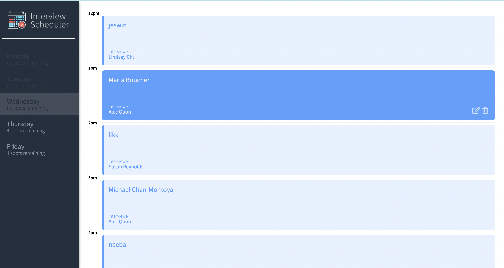
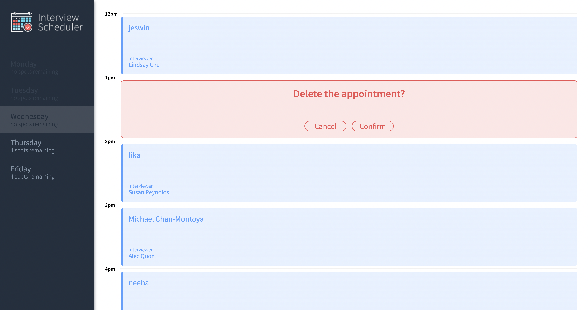
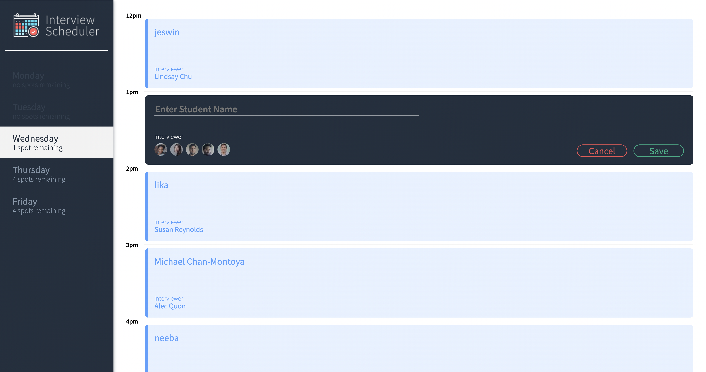
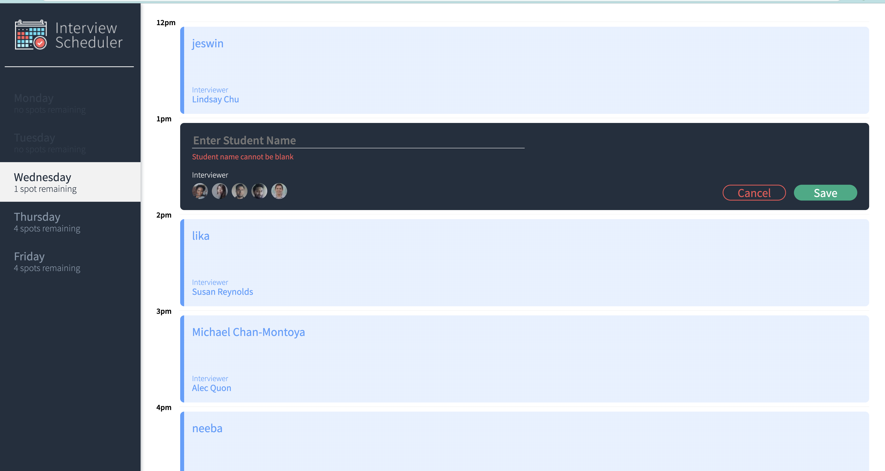

# Interview Scheduler
Try Interview Scheduler! Built with modern React, Interview Scheduler helps you stay on top of all the appointments.

Book, edit, and cancel interviews as you like. Keep track of the scheduled appointments easier than ever before.
## Technology

Single-page application built with modern React practices such as hooks and functional components.

Front-End: HTML, SCSS, React

Back-End: Node, Express, PostgreSQL

## Dependencies

- React 16.9.0 or above
- Axios
- Classnames
- Node.js
- Express
- Node-postgres

## Testing

This app was extensively tested using the following technologies:

- Storybook for unit testing
- Jest for unit and integration testing
- Cypress for end to end testing

## Final product

